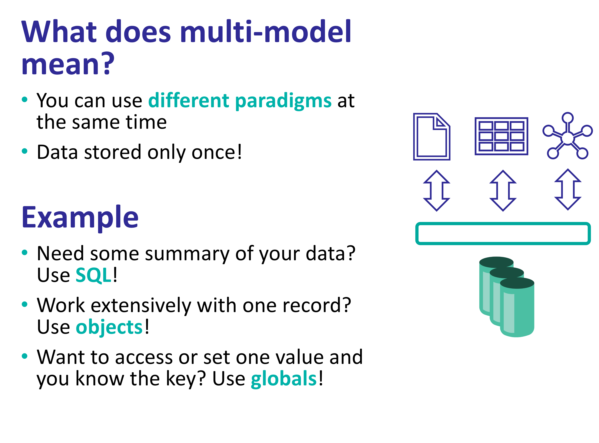

Intro to basic concepts about multi-model database using InterSystems IRIS. You can find more information in [InterSystems Developer Hub](https://developer.intersystems.com)



# What do you need to install? 
* [Git](https://git-scm.com/downloads) 
* [Docker](https://www.docker.com/products/docker-desktop) (if you are using Windows, make sure you set your Docker installation to use "Linux containers").
* [Docker Compose](https://docs.docker.com/compose/install/)
* [Visual Studio Code](https://code.visualstudio.com/download) + [InterSystems ObjectScript VSCode Extension](https://marketplace.visualstudio.com/items?itemName=daimor.vscode-objectscript)

# Setup
Build the image & run the container
```bash
docker compose build
docker compose up -d
```

# Examples

## Create a table / persistent class

Let's create a new persistent class using VS Code:

```objectscript
Class game.Player Extends %Persistent [DDLAllowed]
{
    Property Name As %String(MAXLEN = 255);

    Property Alias As %String(MAXLEN = 50);

    Property Score As %Numeric;
}
```

This persistent class in InterSystems IRIS is also a table.

You could also create the same class using DDL / SQL:
```sql
CREATE Table sample.Player (
    Name VARCHAR(255),
    Alias VARCHAR(50),
    Score NUMERIC
)
```

## Storage definition

After compiling your class in VS Code, it will generate a storage definition. This is automatically done by InterSystems IRIS to handle the persistence of the data.

Pay attention to:
* Type: generated storage type, in our case the default storage for persistent objects
* StreamLocation - global where we store streams
* IndexLocation - global for indices
* IdLocation - global where we store ID autoincremental counter
* **DefaultData** - storage XML element which maps global value to columns/properties
* **DataLocation** - global in which to store data

```objectscript
Class game.Player Extends %Persistent [ DdlAllowed ]
{

Property Name As %String(MAXLEN = 255);

Property Alias As %String(MAXLEN = 50);

Property Score As %Numeric;

Storage Default
{
<Data name="PlayerDefaultData">
<Value name="1">
<Value>%%CLASSNAME</Value>
</Value>
<Value name="2">
<Value>Name</Value>
</Value>
<Value name="3">
<Value>Alias</Value>
</Value>
<Value name="4">
<Value>Score</Value>
</Value>
</Data>
<DataLocation>^game.PlayerD</DataLocation>
<DefaultData>PlayerDefaultData</DefaultData>
<IdLocation>^game.PlayerD</IdLocation>
<IndexLocation>^game.PlayerI</IndexLocation>
<StreamLocation>^game.PlayerS</StreamLocation>
<Type>%Storage.Persistent</Type>
}

}
```

*DefaultData* is `PlayerDefaultData`, it means that the global node has this structure:
* 1 - %%CLASSNAME
* 2 - Name
* 3 - Alias
* 4 - Score


So, the global should look like this:
```objectscript
^game.PlayerD(id) = %%CLASSNAME, Name, Alias, Score
```

## Have a look at the data

We still have no data. 

Open a [WebTerminal](http://localhost:52773/terminal/) session.

Let's add one object:
```objectscript
set p = ##class(game.Player).%New()
set p.Name = "My Player"
set p.Alias = "kraken"
set p.Score = 1377
write p.%Save()
```

You can have a look at the data using SQL in [SQL Explorer](http://localhost:52773/csp/sys/exp/%25CSP.UI.Portal.SQL.Home.zen?$NAMESPACE=USER) or even using an external client through JDBC like *SQLTools* for VS Code.

```sql
select * from game.Player
```

Now, you can display the global in [WebTerminal](http://localhost:52773/terminal/) or even [Global Explorer](http://localhost:52773/csp/sys/exp/UtilExpGlobalView.csp?$ID2=try.PointD&$NAMESPACE=USER&$NAMESPACE=USER)

```objectscript
zwrite ^game.PlayerD
^game.PlayerD=1
^game.PlayerD(1)=$lb("","My Player","kraken",1377)
```

The expected structure %%CLASSNAME, Name, Alias, Score is set with `$lb("","My Player","kraken")` which corresponds to X and Y properties of our object (%%CLASSNAME is system property, ignore it).

Of course, you can also add a row via SQL:

```sql
INSERT INTO game.Player (Name, Alias, Score) VALUES ('Other player','ppp', 1100)
```

The global will look like this:

```objectscript
zwrite ^game.PlayerD
^game.PlayerD=2
^game.PlayerD(1)=$lb("","My Player","kraken",1377)
^game.PlayerD(2)=$lb("","Other player","ppp",1100)
```

You can even open the new player you have just created:
```objectscript
set p2 = ##class(game.Player).%OpenId(2)
zwrite p2
```

Let's delete all the data from the table:

```sql
DELETE FROM game.Player
```

Our global will look like this:
```objectscript
zwrite ^game.PlayerD
^game.PlayerD=2
```

Only ID counter is left, so a new object/row would have an ID=3. Also our class and table continue to exist.

But, what happens when we run:

```sql
DROP TABLE game.Player
```

It will destroy the table, the class and delete the global:

```objectscript
zw ^game.PlayerD
```

## Importing and exporting to JSON / XML

Now have a look at the class [sample.Person](src/sample/Person.cls) class. Can you still find the properties and the storage definition?

Try executing the included sample method by:

```objectscript
do ##class(sample.Person).RunSample()
```

Check out `%JSONREFERENCE` and some other options in [Using the JSON Adaptor](https://docs.intersystems.com/iris20242/csp/docbook/DocBook.UI.Page.cls?KEY=GJSON_adaptor)

Try the following:

After running the sample, you can create a new person:
```objectscript
set json = {"Name":"Other","last":"Person","BirthDate":"1983-11-03","Company":"1"}
set person = ##class(sample.Person).%JSONNew()
write person.%JSONImport(json)
write person.%Save()
```

Try also to create a person but using a non-existent company:
```objectscript
set json = {"Name":"Marc","last":"MMM","BirthDate":"1993-08-03","Company":"7"}
set person = ##class(sample.Person).%JSONNew()
write person.%JSONImport(json)
do $system.Status.DisplayError(%objlasterror)
```

